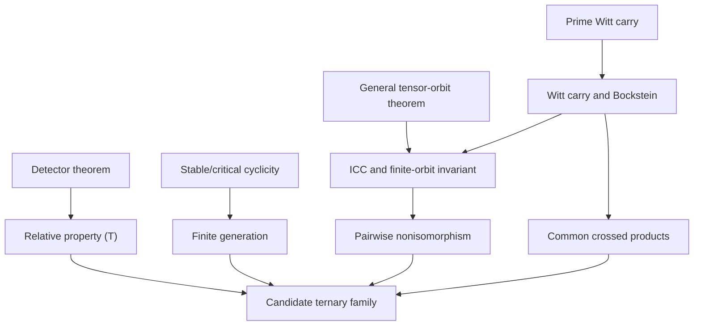

# Discovery packet — 4 August 2026

## Executive conclusion

Two claimed counterexamples to Connes's rigidity conjecture are public:
OpenAI's binary carry construction and Shuoxing Zhou's independent
action-shear construction. A 1 August adversarial manuscript disputes them,
but its public abstract describes different groups and does not presently
identify a flaw in either construction. This packet therefore does **not**
claim a first counterexample or an independently settled final status.

The exploration produced six mathematically substantive targets.

1. A stable/critical cyclicity theorem for divided `p`th powers: every odd
   prime at rank `p`, every prime above the diagonal `r>p`, and in particular
   binary rank three.
2. A prime--rank and degree--rank detector theorem combining primitive boxes
   with affine-chart block erasure.
3. A candidate simplification of the published binary proof that removes its
   auxiliary torsion-free acting group.
4. A stable/critical tensor-orbit theorem for every `2<=m<=r`, generalizing the
   formal rank-three first-factor-symmetric statement.
5. A uniform minimal-rank carry program on `r_p=max(p,3)`, including a new
   candidate binary rank-three carry family and odd-prime families.
6. A ternary/multivariate specialization with the most extensive current
   exact computations and Lean handoffs.

The stable/critical algebra and the detector synthesis are the strongest
possible new mathematical statements. The binary amenable-radical argument is
the strongest possible new proof simplification. Priority is unknown pending
specialist review.

## Claim and dependency map



The carry/common-crossed-product and finite-orbit mechanisms in this diagram
are public binary prior art. The candidate contributions are the new
stable/critical algebra, the detector phase theorem, their minimal-rank
prime-uniform synthesis, and the group-theoretic simplification.

## Result 0 — stable/critical divided-power cyclicity

For a prime `p`, `R=F_p[t_1,...,t_d]`, `V=R^r`, and `r>=p`, let
`B_p=Gamma^p(V)` and let `d_p(v^tensor-p)=v`. If `r>p`, or if `r=p` is odd,
then

```text
ker d_p = span(E_r(R).[e_1,...,e_p]),
B_p     = span(E_r(R).e_1^tensor-p).
```

Above the diagonal, an unused coordinate lowers every positive-degree basis
multiset. On the critical odd diagonal, the exact identity

```text
(u_ij(x)S_y-u_ij(-x)S_y)/2
 = A(x,y,z)+A(xy,1,z)
```

reduces the all-distinct case to repeated-label sources. The proof works over
every finite number of polynomial variables. Exact certificate replay passes
at binary rank three and four, ternary rank four, and prime five in ranks five
and six; the earlier ternary oracles give the deepest truncations.

The companion orbit theorem says that every nonzero tensor in tensor degree
`m` has infinite elementary orbit when `r>m`; at `r=m`, invariance under the
first-two-factor swap suffices. This supplies orbit growth for every divided
power in the same range.

## Result A — ternary divided-cube cyclicity

Let

```text
k=F_3,  R=k[t],  V=R^3,
B=span_k{v tensor v tensor v : v in V}.
```

The cubic diagonal gives the exact sequence

```text
0 -> K -> B --d_3--> V -> 0,       d_3(v tensor-cube)=v.
```

With `E=E_3(R)`, the proof candidate establishes

```text
K = span_k(E.w),
B = span_k(E.q),
```

where `w` is the all-distinct constant orbit sum and
`q=e_1 tensor e_1 tensor e_1`.

The decisive identity is the characteristic-three finite difference

```text
u_ij(2f)S-u_ij(f)S = [fx e_i, x e_j, z e_k],
S=[x e_j,x e_j,z e_k].
```

The linear substitution term survives while the quadratic term cancels because
`2^2=1` in `F_3`. A simultaneous total-degree induction handles the collision
coefficients `1` and `2` and then every all-distinct tensor.

The multivariate proof is stronger. For `R_d=F_3[t_1,...,t_d]`, a two-step
identity removes monomial divisibility:

```text
u_ij(2x)S_y-u_ij(x)S_y
  = A(x,y,z)+A(xy,1,z).
```

The auxiliary term is generated by the equal-source identity, proving
cyclicity for every finite `d`.

### Exact evidence

| model | `dim B` | `dim K` | orbit span | proof ledger |
|---|---:|---:|---:|---:|
| `F_3[t]`, total degree `<=12` | 2273 | 2258 | 2258 | `1+6+1797+454=2258` |
| `F_3[t_1,t_2]`, degree `<=3` | 453 | 444 | 444 | `1+6+354+34+49=444` |
| `F_3[t_1,t_2,t_3]`, degree `<=2` | 307 | 304 | 304 | `1+6+243+27+27=304` |

These are exact finite-field ranks and replayed local certificates. They are
strong falsifiers, not proofs of the untruncated theorem.

## Result B — a degree--rank detector theorem

Let a reduced polynomial detector over `F_p` have degree at most `d`. Write

```text
d=a(p-1)+b,        0<=b<p-1.
```

For finite boxes with enough coefficient variables, the generalized
Reed--Muller relative distance is

```text
s(p,d)=(p-b)/p^(a+1).
```

For `SL_r(F_p[t])`-invariant probabilities, primitive-box averaging gives

```text
c_prim(p,r;d)
  = (s(p,d)-p^(1-r))/(1-p^(1-r)),

c_prim>0 iff (p-b)p^(r-a-2)>1.
```

Affine charts give a complementary theorem. After one simultaneous affine
translation, chart `s` is the coordinate subspace where block `s` vanishes.
If a degree-`d` polynomial vanishes on a set `S` of charts, every monomial uses
every block in `S`; hence `|S|<=d`. Therefore

```text
c_chart(p,r;d)=(r-d)s(p,d)/r,       d<r.
```

This threshold is sharp for the chart family: a degree-`d` reduced monomial
using a positive-degree variable from every block vanishes on all charts when
`d>=r`.

For the divided `p`th-power detector (`d=p`),

```text
c_prim(p,r)=((p-1)/p^2-p^(1-r))/(1-p^(1-r)),
c_chart(p,r)=(r-p)(p-1)/(r p^2).
```

The primitive constant is positive everywhere in rank at least three except
`(p,r)=(2,3)`. The chart constant fills exactly that point and gives `1/12`,
recovering Zhou's binary rank-three detector. At `(p,r)=(3,3)`, primitive
boxes give `1/8`.

### Exact chart-erasure evidence

The restriction-rank oracle computes the joint map to every subset of charts.

| `p` | `d` | `r` | source dimension | minimum nonzero charts |
|---:|---:|---:|---:|---:|
| 2 | 2 | 3 | 22 | 1 |
| 2 | 2 | 4 | 37 | 2 |
| 2 | 2 | 5 | 56 | 3 |
| 3 | 3 | 3 | 78 | 0 |
| 3 | 3 | 4 | 157 | 1 |
| 3 | 3 | 5 | 276 | 2 |

Thus the exact block-erasure distance is `max(r-d,0)` in all six cases. The
focused Lean target checks the numerical detector and spectral constants,
including

```text
c_chart(2,3)=1/12,
c_chart(2,4)=1/8,
c_chart(3,5)=4/45,
3*c_prim(3,3)=3/8.
```

## Result C — remove the binary torsion-free lift

The published binary construction uses a torsion-free group `K` surjecting
onto

```text
Q=SL_4(F_2[t])
```

so that the abelian kernel is the torsion subgroup of each semidirect product.
The candidate simplification uses `Q` directly.

Margulis's normal subgroup theorem and an elementary finite-conjugacy-class
calculation give

```text
Rad_am(Q)=1.
```

For every abelian `Q`-module `A`, projection to `Q` then proves

```text
Rad_am(A semidirect Q)=A.
```

The amenable radical therefore recovers the split module `D` and every carry
module `E_n` intrinsically, even though `Q` contains order-four torsion. The
published exponent and finite-orbit arguments distinguish the groups exactly
as before.

Two more steps become direct:

- the equivariant extension `0->V->E_n->B->0` and the published infinite-orbit
  lemma prove ICC;
- the unchanged `1/7` pointed-space detector and the Cornulier--Tessera
  criterion prove relative property (T).

Thus factor transfer remains an independent check but is needed only for the
common-factor conclusion, not for ICC or property (T). If the normal-subgroup
interface survives expert review, the integral lift, congruence kernel,
torsion-freeness proof, and reduction-surjectivity detour can all be removed.

## Result D — stronger tensor orbit theorem

The formal source strengthens the divided-cube orbit theorem to

```text
Every nonzero tensor in Fix(tau_12) inside
(F[t]^3) tensor-cube has an infinite elementary-transvection orbit.
```

A single tail `u_ij(t^(N+n))` has a coordinate-block observation with infinite
range. The divided cube is contained in this fixed subspace, so its theorem is
a corollary. This source is awaiting the full Lean build; it is not counted as
kernel-checked yet.

## Result E — a uniform minimal-rank prime line

Put `r_p=max(p,3)`. The preceding results align exactly:

```text
p=2, r=3: fresh-coordinate cyclicity + fresh-coordinate orbit
          + affine-chart detector 1/12;

p odd, r=p: critical finite difference + symmetric-tail orbit
             + positive primitive detector.
```

The length-two Witt polynomial

```text
C_p(a,c)=(a^p+c^p-(a+c)^p)/p mod p
```

defines the functional shifted carry for every prime. Exact scalar exhaustion
at `p=2,3,5,7` verifies the cocycle, Teichmuller coordinate, exponent `p^2`,
and multiplication-by-`p` formula. Combining it with the published binary
architecture gives the candidate intrinsic cardinal

```text
|FinOrb(A_n[p]/pA_n)| = p^(r_p n).
```

Thus the binary rank-three candidate has `2^(3n)`, and the odd-prime
rank-`p` candidate has `p^(pn)`. For each fixed prime, the proposed groups are
finitely generated, ICC, property (T), pairwise nonisomorphic, mutually
commensurable, and have common group von Neumann and full/reduced group
C*-algebras. This conclusion remains conditional on independent review and
formalization of the general functional carry, lattice interfaces, and
operator-algebra bridges.

## Ternary counterexample package — status

Combining the paper proof candidates would give countably many groups `G_n`
that are

```text
finitely generated, ICC, property (T), pairwise nonisomorphic,
mutually commensurable, and have common L(G_n), C*(G_n), and C*_r(G_n).
```

The intrinsic parameter is

```text
|FinOrb(A_n[3]/3A_n)|=3^(3n),
```

and the finite-index embedding has index `3^(3n)`. These mechanisms have a
published binary analogue, so the possible contribution is the ternary
realization and its algebra, not the counterexample architecture.

This package is **not promoted**. The compact-dual construction, Bockstein
identification, relative-property-(T) interface, and operator-algebra bridges
still need independent review and formalization.

## Evidence status

| component | strongest current evidence |
|---|---|
| scalar Witt carry | archived Research Kernel, LEAP, Morph, Lean source, Julia exhaustion |
| cyclicity | complete paper proof candidate + exact degree-12/multivariate ledgers |
| stable/critical cyclicity | paper proof + exact `(2,3),(2,4),(3,4),(5,5),(5,6)` certificates |
| general tensor orbit theorem | paper proof; rank-three Lean source awaiting full build |
| prime Witt scalar law | exact exhaustive checks at `p=2,3,5,7` |
| chart theorem | paper proof + six exact restriction-rank cases |
| detector arithmetic | focused Lean build green |
| Frobenius correction | focused Lean build green |
| symmetric orbit strengthening | Lean source awaiting full build |
| full 51-module Lean graph | six repaired remote failures; new clean CI required |
| novelty | current-paper comparison complete; specialist priority review required |

## Highest-value next reviews

1. Check Margulis normal-subgroup hypotheses uniformly for
   `SL_(max(p,3))(F_p[t])` and verify every carry map is equivariant.
2. Formalize the monomial chart-ideal intersection and the stable/critical
   cyclicity and orbit inductions.
3. Formalize the Bockstein exact sequence and the finite-orbit subquotient.
4. Audit the property-(T) measure-stability lemma and direct
   Cornulier--Tessera argument.
5. Seek modular-representation, coding-theory, and operator-algebra review
   before any priority language is used.
6. Obtain and audit a stable version of the current adversarial invalidity
   manuscript against the actual `F_2[t]` carry and Zhou action-shear groups.

## Primary prior art

- OpenAI, Chapter 4, [A Counterexample to Connes's Rigidity
  Conjecture](https://cdn.openai.com/pdf/ten-proofs-oai.pdf#page=95).
- S. Zhou, [ICC property (T) groups without
  W*-superrigidity](https://arxiv.org/abs/2608.02327).
- Y. de Cornulier and R. Tessera, [A characterization of relative Kazhdan
  property T for semidirect products with abelian
  groups](https://arxiv.org/abs/0911.3371).
